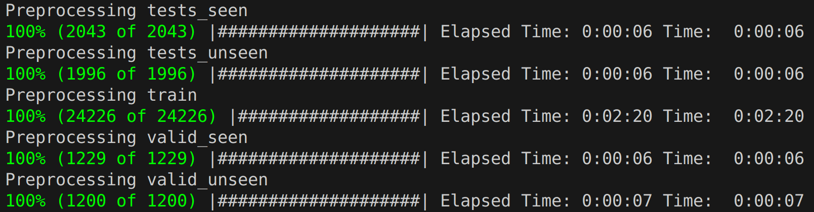
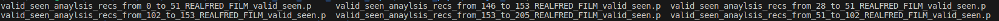

# ReALFRED-CAPEAM
This is the code repository of the paper [Context-Aware Planning and Environment-Aware Memory for Instruction Following Embodied Agents](https://arxiv.org/abs/2308.07241) for reproduction in [ReALFRED](https://github.com/snumprlab/realfred). \
Our code is largely built upon the codebase from [CAPEAM](https://github.com/snumprlab/capeam).

### Clone repository
```
$ git clone https://github.com/snumprlab/realfred.git
$ cd realfred/capeam
$ export ALFRED_ROOT=$(pwd)
```

### Install requirements
```
$ conda create -n recapeam python=3.6
$ conda activate recapeam

$ cd $ALFRED_ROOT
$ pip install --upgrade pip
$ pip install -r requirements.txt
```
You also need to install Pytorch depending on your system. e.g., PyTorch v1.8.1 + cuda 11.1 <br>
Refer [here](https://pytorch.kr/get-started/previous-versions/)
```
pip install torch==1.8.1+cu111 torchvision==0.9.1+cu111 torchaudio==0.8.1 -f https://download.pytorch.org/whl/torch_stable.html
```
If you want to visualize semantic segmentation outputs, install detectron2 according to your system configuration. (You do not need to install this unless you want to visualize segemtnation outputs on the egocentric rgb frame as in the "segmented RGB" here). If you are using conda:
```
python -m pip install detectron2 -f \
  https://dl.fbaipublicfiles.com/detectron2/wheels/cu111/torch1.8/index.html
```

## Additional preliminaries to use ReALFRED scenes

Please make sure that ai2thor's version is 4.3.0.
1. Download the annotation files from <a href="https://huggingface.co/datasets/SNUMPR/realfred_json">the Hugging Face repo</a>.
```
git clone https://huggingface.co/datasets/SNUMPR/realfred_json alfred_data_all
```


2. Now,
* Go to 'CAPEAM' directory (this repository). 
```
$ export CAPEAM=$(pwd)
```

* Go to a directory you would like to git clone "alfred". Then run,
```
$ git clone https://github.com/askforalfred/alfred.git
$ export ALFRED_ROOT=$(pwd)/alfred
```

* Now run
```
$ cd $ALFRED_ROOT
$ python models/train/train_seq2seq.py --data $CAPEAM/alfred_data_all/Re_json_2.1.0 --model seq2seq_im_mask --dout exp/model:{model},name:pm_and_subgoals_01 --splits $CAPEAM/alfred_data_all/splits/oct24.json --gpu --batch 8 --pm_aux_loss_wt 0.1 --subgoal_aux_loss_wt 0.1 --preprocess
```

The will take 2~5 minutes. You will see this:



Once the bars for preprocessing are all filled, the code will break with an error message. (You can ignore and proceed). 

* Now run,
```
$ cd $CAPEAM
$ mkdir alfred_data_small
$ ln -s alfred_data_small $CAPEAM/alfred_data_all
```

## Download Trained models
0. Download "Pretrained_Models_CAPEAM" from [this link](https://drive.google.com/file/d/1mkypSblrc0U3k3kGcuPzVOaY1Rt9Lqpa/view?usp=sharing) and unzip it.
```
unzip Pretrained_Models_realfred.zip
```

1. Semantic segmentation

```
mv mrcnn_objects_best.pt $CAPEAM
mv mrcnn_receptacles_best.pt $CAPEAM
```

2. Depth prediction

```
mv depth_models $CAPEAM/models/depth/depth_models
```

3. Semantic Search Policy

```
mv best_model_multi.pt $CAPEAM/models/semantic_policy/best_model_multi.pt
```


## Model Inference

### Run main

**Caveat**: Multiprocessing (using --num_processes > 1) will make the construction of semantic mapping slower. We recommend that you use "--num_processes 1" (or a number around 2) and just run several jobs. (E.g. one job with episodes from 0 to 200, another job with episodes from 200 to 400, etc)

e.g., Run following command to evaluate FILM.
```
export $SPLIT=valid_seen
export $FROM_IDX=0
export $TO_IDX=50
$ python main.py \
        --max_episode_length 1000       \
        --num_local_step 25     \
        --num_processes 1       \
        --eval_split $SPLIT     \
        --from_idx $FROM_IDX    \
        --to_idx $TO_IDX        \
        --max_fails 10  \
        --debug_local   \
        --set_dn realfred-film-${SPLIT} \
        --which_gpu 0   \
        --sem_gpu_id 0  \
        --sem_seg_gpu 0 \
        --depth_gpu 0   \
        --x_display 1   \
        --data "alfred_data_all/Re_json_2.1.0"   \
        --splits "alfred_data_small/splits/oct24.json" \
        --learned_depth \
        --use_sem_policy  \
        --appended \
        --use_sem_seg   \
        --appended \

```
Or you could run 
```
bash eval_total_valid.sh
bash eval_total_tests.sh
```

## Evaluate results
The output of your runs are saved in the pickles of "results/analyze_recs/".
For example, you may see results like the following in your "results/analyze_recs/".


Change directory to "results/analyze_recs/" and inside a python3 console,

```
python val_sr.py
```

## (Optional) Context-aware planner
While this repository provides pre-generated context-aware planning results, you can refer [here](planner/README.md) to reproduce the training and generating plans.

## Hardware 
Trained and Tested on:
- **GPU** - RTX A6000
- **CPU** - Intel(R) Core(TM) i7-12700K CPU @ 3.60GHz
- **RAM** - 64GB
- **OS** - Ubuntu 20.04

## Citation
ReALFRED
```
@inproceedings{kim2024realfred,
  author    = {Kim, Taewoong and Min, Cheolhong and Kim, Byeonghwi and Kim, Jinyeon and Jeung, Wonje and Choi, Jonghyun},
  title     = {ReALFRED: An Embodied Instruction Following Benchmark in Photo-Realistic Environment},
  booktitle = {ECCV},
  year      = {2024}
  }
```
CAPEAM
```
@inproceedings{kim2023context,
  author    = {Kim, Byeonghwi and Kim, Jinyeon and Kim, Yuyeong and Min, Cheolhong and Choi, Jonghyun},
  title     = {Context-Aware Planning and Environment-Aware Memory for Instruction Following Embodied Agents},
  booktitle = {ICCV},
  year      = {2023}
}
```